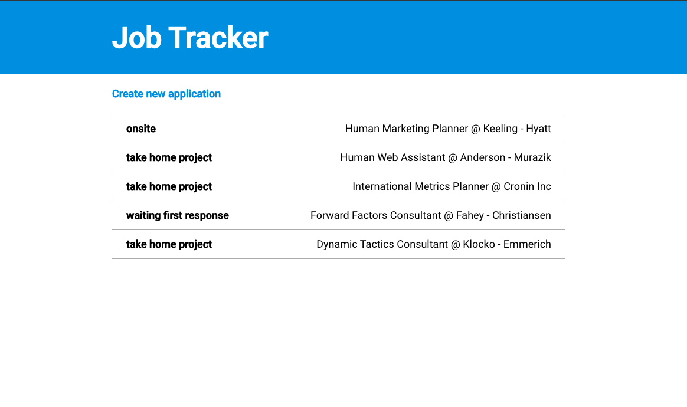
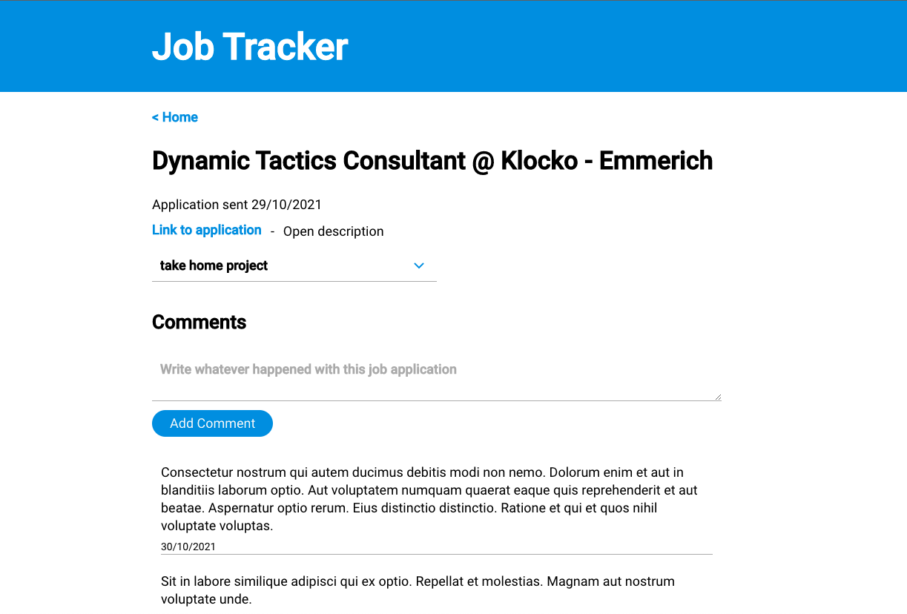
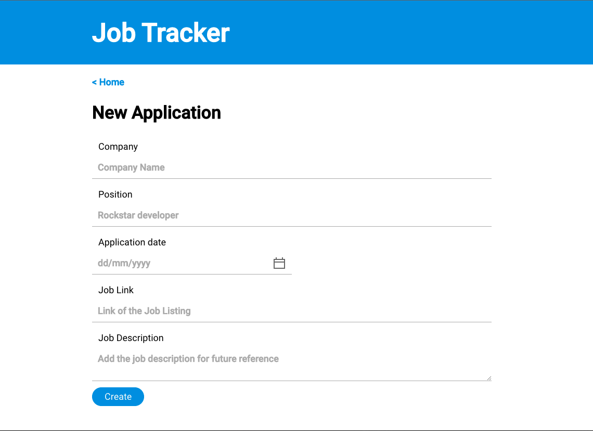

# Job Tracker Application

Web application to track your job applications.

* A user can create a new application
* A user can see all the applications
* A user can see the details of one application
* A user can add comments to one application
* A user can change the status of one application

## Development

There are two main folders.

* "job-tracker-backend" is the api project built with [Express](https://expressjs.com/).
* "job-tracker-frontend" is the frontend project built with [create-react-app](https://reactjs.org/docs/create-a-new-react-app.html).

For more details on the structure of the project and the decisions go to [ARCHITECTURE.md](./ARCHITECTURE.md).

### Main libraries

The backend is a raw Express project. Only complementary libraries like [cors](https://www.npmjs.com/package/cors) and [body-parser](https://www.npmjs.com/package/body-parser) have been used. For the creationg or ids I have used [uuid](https://www.npmjs.com/package/uuid).

The frontend is a project built with [create-react-app](https://reactjs.org/docs/create-a-new-react-app.html). I used the typescript variation to add an extra layer of testing with types. [Grommet](https://v2.grommet.io/) is used as the UI framework, which also requires [styled-components](https://www.styled-components.com/) even though I didn't use it directly.

For frontend routing I used [react-router-dom](https://reactrouter.com/web/guides/quick-start) and I relied on React state instead of adding a specific state management library.

### Setup

Requirement: Node version older than v12.

Go into each folder and run `npm install`.

### Run project

Make sure you run the setup first.

First, run the backend:

* Go into the folder "job-tracker-backend".
* Execute `npm run start:dev`.

Then, in parallel, in another terminal tab, run the frontend:

* Go into the folder "job-tracker-frontend".
* Execute `npm start`.

**Visit [Localhost 3000](http://localhost:3000/) to see it in action.**

### Database

The project does not rely on any database, instead it persists the data in JSON files.

The repository already comes populated with data. To repopulate go to the "job-tracker-backend" folder and run `npm run db:populate`.

## Screenshots

## Testing

I used the testing setup provided by "create-react-app" to perform a unit test of the main component as well as a helper.

To run the test:

* Go into the folder "job-tracker-frontend".
* Execute `npm run test`.
